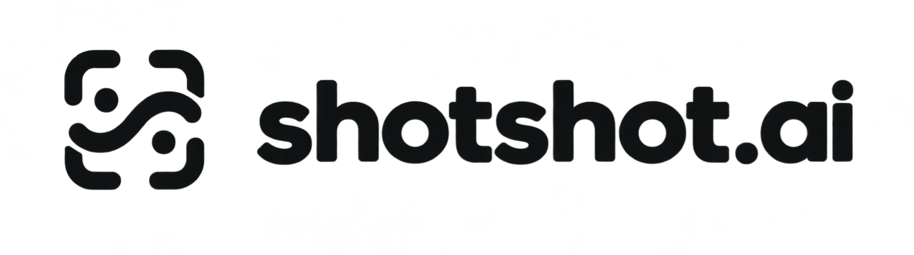
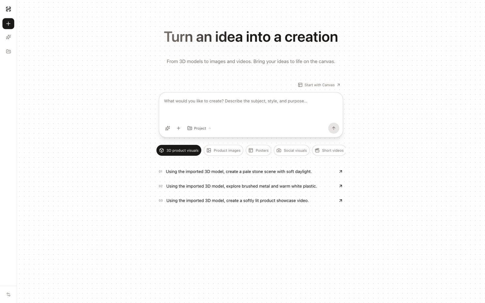

<p align="center">
  
</p>

<h1 align="center">OpenShotShot</h1>

<p align="center">OpenShotShot — an open-source AIGC creative workspace. Infinite canvas with a built-in Agent.</p>

<p align="center"><a href="./README.md">English</a> | <a href="./README.zh-CN.md">简体中文</a></p>

<p align="center">
  
</p>

---

## Core Features

- **Infinite canvas**: image, text, video, audio, 3D model and other node types can be freely placed, scaled and connected — turning one-shot generation into continuous iteration.
- **Built-in canvas agent**: a locally running agent that understands canvas context and directly generates nodes, organizes layouts and chains workflows.
- **BYOK multimodal generation**: use your own API key over OpenAI-compatible channels or built-in presets (DeepSeek, Moonshot, MiniMax, Zhipu, OpenRouter, fal.ai, etc.) to generate images, videos, audio and 3D content.
- **ChatGPT subscription connection**: on desktop, sign in with a ChatGPT subscription and call models directly — no separate API key required.
- **Skills & node plugins**: local Skills extend the agent's capabilities; canvas node plugins extend node types.
- **Local-first**: canvases and assets are stored on your machine by default with optional WebDAV sync; asset & prompt libraries help you keep every good result.

## Quick Start

Requires Node.js 22+.

```bash
git clone https://github.com/rendylong/openshotshot.git
cd openshotshot
```

### Web

```bash
cd web
npm install
npm run dev
```

Open <http://localhost:3000> in your browser.

### Desktop (Electron)

Two terminals are needed: start the web renderer first, then the desktop app.

```bash
# Terminal 1: web renderer
cd web
npm install
npm run dev
```

```bash
# Terminal 2: desktop app (repo root)
npm install
npm run dev
```

### Docker

```bash
docker compose up --build
```

This builds a local image and starts it; open <http://localhost:3000>. The container only serves static pages — AI requests go directly from your browser to the provider you configure.

## BYOK

Open **Model & API settings**, add an OpenAI-compatible channel (Base URL + API Key), or pick a provider from the preset list. API keys are stored only on your device: the browser connects directly to the endpoint you configure, and the Electron desktop app proxies cross-origin requests through its main process when needed. There is no remote server of ours that touches your keys or your generated data.

## Important Notes

- Local data formats are still evolving and backward compatibility is not guaranteed yet — do not keep the only copy of important data inside the app.
- API keys are stored only in local browser or desktop storage; keep your device secure.

## License & Acknowledgements

OpenShotShot is based on [infinite-canvas](https://github.com/basketikun/infinite-canvas) and continuously evolves on top of it — product experience, desktop app, local agent, skills and plugin capabilities. Thanks to the original project and all contributors of the open-source dependencies.

Released under the [MIT License](LICENSE). When using, modifying or redistributing, please keep the copyright and permission notices in the license.
